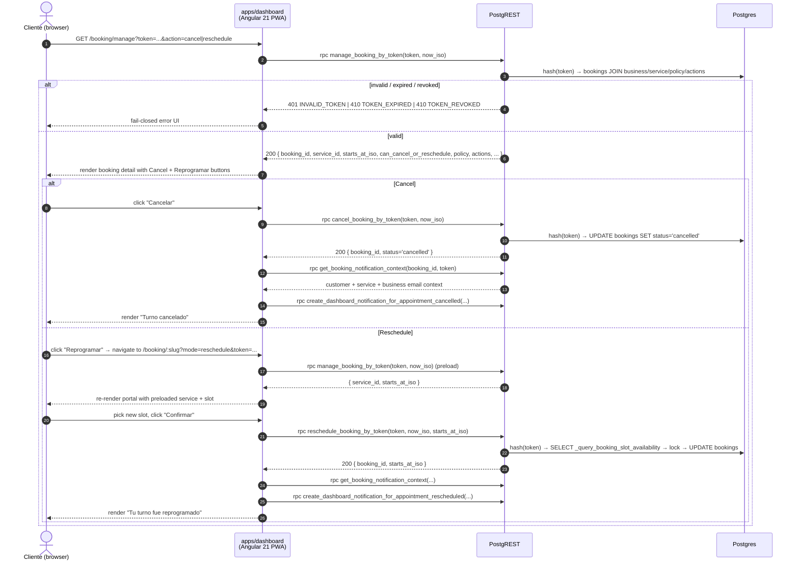

# 02 — Public Booking Flow

> **Version**: current `dev` (post MVP Phase 1 + Core Slice 3/5, pre-release-2.0) · **Owner**: @santi · **State**: CURRENT (NOT target — see [Known gaps](#known-risks-and-gaps))

```mermaid
sequenceDiagram
    autonumber
    actor C as Cliente (browser)
    participant Dash as apps/dashboard<br/>(Angular 21 PWA)
    participant PR as PostgREST<br/>(Supabase REST)
    participant DB as Postgres<br/>(public schema)
    participant OB as process-email-outbox<br/>(Edge Function cron)

    C->>Dash: GET /booking/:slug
    Dash->>PR: rpc resolve_business_by_slug(business_slug)
    PR->>DB: SELECT businesses WHERE slug = $1 OR slug_canonical = canonical_booking_slug($1)
    DB-->>PR: { id, slug, name, timezone, account_closed_at? }
    PR-->>Dash: 200 { id, slug, name, timezone }
    Dash->>PR: SELECT * FROM business_settings WHERE business_id = $1
    PR-->>Dash: { working_hours, support_email, ... }
    Dash->>PR: rpc query_public_slot_availability(slug, service_id, date)
    PR->>DB: _assert_business_accepts_public_bookings(id)
    DB-->>PR: ok | BUSINESS_ACCOUNT_CLOSED
    PR->>DB: _query_booking_slot_availability(business_id, service_id, date, branch_id, ...)
    DB-->>PR: TABLE (starts_at_iso, ends_at_iso, remaining_capacity)
    PR-->>Dash: 200 { slots: [...] }
    Dash-->>C: render service list + day strip + slot grid

    C->>Dash: pick service, date, slot, fill name/email/whatsapp/notes
    C->>Dash: click "Confirmar reserva" (submitBooking)
    Dash->>Dash: validatePublicBookingForm (Zod-equivalent)
    Dash->>PR: rpc create_public_booking(business_slug, service_id, starts_at_iso, client, notes, branch_id=NULL)
    PR->>DB: _assert_business_accepts_public_bookings(business_id)
    PR->>DB: SELECT branches WHERE slug='principal' AND is_active (fallback)
    PR->>DB: SELECT service duration_minutes
    PR->>DB: _query_booking_slot_availability(...) WHERE starts_at_iso = $input AND remaining_capacity > 0
    alt no canonical slot match
        PR-->>Dash: 400 SLOT_CONFLICT
        Dash-->>C: show "Ese horario se acaba de ocupar..." (getPublicBookingSubmitErrorMessage)
    else slot available
        PR->>DB: _lock_booking_conflict_window + _assert_no_slot_conflict
        PR->>DB: INSERT customers + INSERT bookings (manage_token_hash, manage_token_expires_at = ends_at + 1h, source='client-self-service')
        PR->>DB: INSERT notification_email_outbox (appointment_created_business) - REQUIRED
        opt customer email provided
            PR->>DB: INSERT notification_email_outbox (appointment_confirmation)
        end
        PR-->>Dash: 201 { booking_id, status='confirmed', manage_token, branch_id, db_atomic_visibility_notifications=true }
        Dash->>Dash: bookingConfirmed = true; dispatch booking.created
        Dash-->>C: render "Tu reserva está confirmada"
    end

    Note over OB,DB: Out-of-band (cron-driven, not in user request path)
    OB->>DB: SELECT notification_email_outbox WHERE sent_at IS NULL
    DB-->>OB: pending rows
    OB->>OB: render template (appointment_confirmation / appointment_created_business)
    OB->>C: SMTP - email with manage URLs /booking/manage?token=...&action=cancel|reschedule
    OB->>DB: UPDATE notification_email_outbox SET sent_at = now()
```



## What this shows

- End-to-end happy path from the customer's first visit to a public booking URL through confirmation, plus the self-service manage / cancel / reschedule path driven by the manage token returned from `create_public_booking`.
- The three RPCs the public booking page calls: `resolve_business_by_slug`, `query_public_slot_availability`, `create_public_booking` (all from `apps/dashboard/src/app/core/api/supabase-booking/real-gateway.ts`).
- The four post-RPC side effects owned by the database inside `create_public_booking`: branch resolution (fallback to `principal`), canonical availability re-check via `_query_booking_slot_availability`, conflict-window lock + assertion, and outbox enqueue for `appointment_created_business` (+ optional `appointment_confirmation`).
- Where the manage URLs the customer receives are minted (inside the `appointment_confirmation` email payload in `notification_email_outbox`, then delivered by `process-email-outbox` cron) and how `manage_booking_by_token` / `cancel_booking_by_token` / `reschedule_booking_by_token` close the loop.
- How dashboard-side notifications are produced on cancel / reschedule (post-RPC `create_dashboard_notification_for_appointment_cancelled` / `_rescheduled`).

## What it does NOT show (see other diagrams)

- Auth + session handoff for the admin/owner dashboard → `01-monorepo-architecture.md` (current) and `02-auth-target` (target, slot reserved in `docs/diagrams/README.md`).
- Target post-release-2.0 architecture (outbox purge, `confirm-email.ts` only for signup, multi-profesional modeling) → `01-monorepo-architecture.md` and `07-multi-profesional`.
- PWA offline walk-in queue and service-worker / IDB boundary → `04-pwa-offline-walkin-queue`, `05-pwa-sw-idb-boundary`.
- Admin manual booking, blocked-time creation, and reschedule from inside the dashboard shell (those go through `create_admin_manual_booking`, `create_admin_blocked_time`, `update_admin_booking`, `cancel_admin_booking`, `reschedule_admin_booking` — same gateway, different callers).

## URL & routing

The public booking URL is **owned by `apps/dashboard`**, not `apps/landing`. Both surfaces are deployed to Vercel and share the dashboard origin.

| Path | Component | File |
|------|-----------|------|
| `/booking/:slug` | `PublicBookingPage` | `apps/dashboard/src/app/features/booking/pages/public/public-booking.page.ts` registered at `apps/dashboard/src/app/app.routes.ts:65-68` |
| `/booking/manage` | `ManageBookingPage` | `apps/dashboard/src/app/features/booking/pages/public/manage-booking.page.ts` registered at `apps/dashboard/src/app/app.routes.ts:60-63` |
| `/booking/:slug?mode=reschedule&token=...` | `PublicBookingPage` (reschedule preload) | same page, query-param driven (`applyReschedulePreload()` at `public-booking.page.ts:539-611`) |

The canonical production origin is hardcoded to `https://orvel.pro` in `packages/booking/src/domain/public-booking-url.ts`. `getPublicBookingOrigin()` keeps the current origin for `localhost`, `127.0.0.1`, `0.0.0.0`, and `qa.orvel.pro`; hosted production hosts (`dashboard.orvel.pro`, `www.orvel.pro`, `orvel.pro`) still rewrite to `https://orvel.pro`. The full URL builder is `buildPublicBookingUrl(slug)` (dashboard shim at `apps/dashboard/src/app/core/booking/public-booking-url.ts`).

## Components / files

### Frontend (apps/dashboard)

| Layer | File | Role |
|-------|------|------|
| Router | `src/app/app.routes.ts` | Mounts `/booking/manage` and `/booking/:slug` outside the `dashboardAuthGuard` so the page is reachable anonymously |
| Page | `src/app/features/booking/pages/public/public-booking.page.ts` | Component orchestrator: slug → services → days → slots → submit; also handles `?mode=reschedule&token=...` preload |
| Template | `src/app/features/booking/pages/public/public-booking.page.html` | UI markup (service dropdown, day strip, slot grid, client form, confirmation card) |
| Validation | `src/app/features/booking/pages/public/public-booking.validation.ts` | `validatePublicBookingForm()` — Zod-equivalent client-side guard |
| Day math | `src/app/features/booking/pages/public/public-booking-days.ts` | `buildPublicBookingDays()`, `toLocalCivilDate()`, weekday key derivation in business timezone |
| Error UX | `src/app/features/booking/pages/public/public-booking-error-messages.ts` | Maps RPC error codes (`SLOT_CONFLICT`, `BUSINESS_NOT_FOUND`, `BOOKING_TOO_SOON`, etc.) to user-facing copy |
| Manage page | `src/app/features/booking/pages/public/manage-booking.page.ts` | Token-gated cancel/reschedule UI; fail-closed on `INVALID_TOKEN` / `TOKEN_EXPIRED` / `TOKEN_REVOKED` / `BOOKING_ALREADY_CANCELLED` / `POLICY_WINDOW_CLOSED` |
| Data access | `src/app/features/booking/data-access/public-booking.service.ts` | Thin wrapper over the gateway: `resolveBusinessBySlug`, `queryPublicSlotAvailability`, `createPublicBooking`, `manageBookingByToken`, `cancelBookingByToken`, `rescheduleBookingByToken` |
| Gateway | `src/app/core/api/supabase-booking/real-gateway.ts` | Anonymous Supabase client + per-method RPC calls; status-code mapping (`SLOT_CONFLICT`/`BLOCKED_TIME_COLLISION` → 409, `BOOKING_TOO_SOON`/`BOOKING_TOO_FAR_ADVANCE` → 422, `INVALID_TOKEN` → 401, `TOKEN_EXPIRED` → 410, `POLICY_WINDOW_CLOSED` → 403) |
| URL builder | `src/app/core/booking/public-booking-url.ts` | `buildPublicBookingUrl(slug)` — what the dashboard surfaces to operators in settings and home |
| Slug guard | `src/app/core/api/supabase-booking/public-booking-slug.ts` | `isValidPublicBookingSlug`, `normalizePublicBookingSlug` — applied before every RPC call |
| Observability | `src/app/core/observability/public-booking-operational-events.ts` | `emitPublicBookingFailureEvent({ stage, status, code, retryable })` — funneled into `record_public_booking_failure` RPC (table `public_booking_failure_events`) |

### Backend (Supabase / Postgres)

| Object | Location | Purpose |
|--------|----------|---------|
| RPC `resolve_business_by_slug(business_slug)` | `supabase/migrations/20260529001000_public_booking_slug_resolver.sql` | First call from the page; returns `{id, slug, name, timezone}` (anon-callable) |
| RPC `query_public_slot_availability(business_slug, service_id, date_iso)` | Latest body in `supabase/migrations/20260708234500_account_closure_blocks_public_booking.sql:30-...` | Public-facing slot listing; rejects closed accounts via `_assert_business_accepts_public_bookings` |
| RPC `create_public_booking(business_slug, service_id, starts_at_iso, client jsonb, notes, professional_id, branch_id)` | Latest body in `supabase/migrations/20260705213000_harden_public_booking_email_before_bell.sql:9-222` (the 6-arg overload resolves to the 7-arg impl) | Single canonical entry point — branches, availability, lock, insert, outbox enqueue |
| RPC `_query_booking_slot_availability(business_id, service_id, date, branch_id, ...)` | `supabase/migrations/20260609060000_core_slice5_admin_slot_availability.sql` | `REVOKE ... FROM PUBLIC` — internal canonical availability check used by both `create_public_booking` and admin reschedule |
| RPC `manage_booking_by_token(token, now_iso)` | Same family of migrations as `create_public_booking` | Token-gated read of booking + business + service + policy + actions |
| RPC `cancel_booking_by_token(token, now_iso)` | Same family | Idempotent cancel; on success returns `{booking_id, status:'cancelled'}` |
| RPC `reschedule_booking_by_token(token, now_iso, starts_at_iso)` | Same family | Re-checks `_query_booking_slot_availability` (per `20260628143000_enforce_reschedule_canonical_availability.sql`) |
| RPC `record_public_booking_failure(...)` | `supabase/migrations/20260627235500_public_booking_failure_telemetry.sql` | Telemetry sink for client-side failures |
| RPC `get_booking_notification_context(booking_id, manage_token)` | `real-gateway.ts:34-60` consumes it after cancel/reschedule | Hydrates customer + service + business context for `create_dashboard_notification_for_appointment_*` |
| Trigger `ensure_business_principal_branch` | `supabase/migrations/20260702110000_ensure_business_principal_branch_for_public_booking.sql:42-45` | `AFTER INSERT OR UPDATE OF timezone ON businesses` — guarantees an active `slug='principal'` branch per business so `create_public_booking`'s fallback never has to invent one |
| Edge Function `process-email-outbox` | `supabase/functions/process-email-outbox/index.ts` | Cron-driven dispatcher that turns `notification_email_outbox` rows into SMTP messages (still alive on `dev`; **purged in target** per `01-monorepo-architecture.md`) |

## RPC contracts

| RPC | Caller | Args (logical) | Returns | Anon-granted? |
|-----|--------|----------------|---------|---------------|
| `resolve_business_by_slug` | `PublicBookingPage.ngOnInit` | `business_slug text` | `{ id, slug, name, timezone }` | yes |
| `query_public_slot_availability` | `PublicBookingPage.loadAvailability` + `checkDaysAvailability` (parallel fan-out per day) | `business_slug text, service_id text, date_iso text` | `TABLE (starts_at_iso text, ends_at_iso text, remaining_capacity int)` | yes |
| `create_public_booking` | `PublicBookingPage.submitBooking` | `business_slug text, service_id text, starts_at_iso text, client jsonb, notes text, professional_id text, branch_id text` (last 3 default NULL) | `jsonb { booking_id, status, manage_token, source, ... }` | yes |
| `manage_booking_by_token` | `ManageBookingPage.ngOnInit` + `PublicBookingPage.loadTokenBackedReschedulePreload` | `token text, now_iso text` | `{ booking_id, business_id, service_id, starts_at_iso, can_cancel_or_reschedule, policy, actions, ... }` | yes |
| `cancel_booking_by_token` | `ManageBookingPage.handleCancel` | `token text, now_iso text` | `{ booking_id, status: 'cancelled' }` | yes |
| `reschedule_booking_by_token` | `PublicBookingPage.submitBooking` (reschedule branch) | `token text, now_iso text, starts_at_iso text` | `{ booking_id, starts_at_iso }` | yes |

`create_public_booking` returns the **raw** `manage_token` (32 random bytes hex-encoded) exactly once. The page receives it (`responseData.manageToken` in `real-gateway.ts:284`) but the current `PublicBookingPage` **does not consume it** in the confirmation UI — it is persisted server-side as a hash via `_hash_manage_token(v_management_bearer)` into `bookings.manage_token_hash`, with `manage_token_expires_at = v_ends_at + interval '1 hour'`, and the customer-facing confirmation card renders "Tu reserva está confirmada" without embedding a manage deep-link. The token reaches the customer only through the `appointment_confirmation` email rendered by `process-email-outbox` (template payload in `20260705213000_...sql:168-172`).

`branch_id` is sent as `null` by the dashboard (`real-gateway.ts:247`). The RPC falls back to the tenant's existing active `slug='principal'` branch (`20260705213000_...sql:75-82`) and raises `BOOKING_BRANCH_CONFIGURATION_REQUIRED` if none exists — it will never create or repair a branch at runtime, by contract (`p0-public-booking-static-contracts.test.ts:147-167`).

## Lifecycle migrations that gate this flow

The orchestrator brief named two migrations as gating; both are real but on `dev` they are now subsumed by the latest redefinition. Reading in reverse-chronological order shows the current effective state:

| Migration | Role on `dev` |
|-----------|---------------|
| `20260724012000_add_business_settings_booking_knobs.sql` | **Latest** — redefines `create_public_booking` to honor `min_lead_minutes` / `max_advance_days` from `business_settings`; redefines `query_public_slot_availability`, `manage_booking_by_token`, `cancel_booking_by_token`, `reschedule_booking_by_token` to honor the same knobs |
| `20260713000001_relax_business_email_outbox.sql` | Relaxes the `appointment_created_business` outbox requirement when the business email is unknown |
| `20260713000000_harden_dashboard_notifications_required.sql` | Tightens dashboard-side notifications on cancel/reschedule |
| `20260708234500_account_closure_blocks_public_booking.sql` | Adds `_assert_business_accepts_public_bookings()` — `create_public_booking`, `query_public_slot_availability`, `manage_booking_by_token`, `cancel_booking_by_token`, `reschedule_booking_by_token` all reject `BUSINESS_ACCOUNT_CLOSED` |
| `20260705213000_harden_public_booking_email_before_bell.sql` | Current canonical body: principal-branch fallback lookup, business email outbox (`BUSINESS_EMAIL_OUTBOX_REQUIRED` if missing), optional customer email, atomic visibility marker (`db_atomic_visibility_notifications`) |
| `20260704193000_harden_public_booking_business_email_recipient.sql` | Introduces `_resolve_booking_business_email` (settings → owner user → owner `business_members`) and `_enqueue_booking_lifecycle_email` |
| `20260704140000_fix_public_booking_dashboard_and_email_contracts.sql` | Dashboard ↔ email contract alignment |
| `20260702110000_ensure_business_principal_branch_for_public_booking.sql` | Trigger `ensure_business_principal_branch` on `businesses` — every business gets an active `slug='principal'` branch at INSERT/UPDATE |
| `20260630115000_preserve_public_booking_lifecycle_update_emails.sql` | Preserve lifecycle update emails through admin edits |
| `20260629234000_atomic_public_booking_visibility_notifications.sql` | Atomic visibility for public self-service (`db_atomic_visibility_notifications=true` marker) |
| `20260627235500_public_booking_failure_telemetry.sql` | `record_public_booking_failure` + `public_booking_failure_events` table |
| `20260627210000_enforce_public_booking_canonical_availability.sql` | Original canonical availability enforcement inside `create_public_booking` (orchestrator-named gate) — now subsumed by `20260705213000_...` |
| `20260628143000_enforce_reschedule_canonical_availability.sql` | Same canonical check inside `reschedule_booking_by_token` |
| `20260616130000_hash_only_booking_management_bearers.sql` | Hash-only manage bearers — `bookings.manage_token` column nullable; only `manage_token_hash` is persisted |
| `20260615174014_harden_public_bookings_direct_access.sql` | Revokes direct table access on `bookings`/`customers` from anon/authenticated |
| `20260615193000_expire_public_booking_notification_context.sql` | Expiry semantics on notification context |
| `20260611214712_booking_conflict_window_locks_create_rpcs.sql` | `_lock_booking_conflict_window` + `_assert_no_slot_conflict` helpers |
| `20260609141000_fix_public_booking_manage_token_encoding.sql` | Manage token encoding fix (hex) |
| `20260609140000_fix_supabase_lint_blockers.sql` | Adds `slug_canonical = canonical_booking_slug(...)` to business lookup |
| `20260609060000_core_slice5_admin_slot_availability.sql` | Defines `_query_booking_slot_availability` (internal, revoked from PUBLIC) |
| `20260609030000_core_slice3_booking_canonical_contract.sql` | Original canonical contract for `create_public_booking` |
| `20260608000000_mvp_phase1_booking_contracts.sql` | MVP Phase 1 first cut |
| `20260609130000_p0_mvp_backend_contract_fixes.sql` | P0 fix-ups |
| `20260529001000_public_booking_slug_resolver.sql` | `resolve_business_by_slug` |
| `20260428110000_fix_public_booking_customers.sql` | Earliest `create_public_booking` in this lineage |

> The `chore/openspec-stale-changes-archive-v2` branch (current working branch) may contain migration renames or archived `openspec/changes/` folders. Before editing, run `git log --oneline supabase/migrations/` and `pnpm --dir supabase exec supabase migration list` to confirm what is live on `dev` vs. local.

## Pre-conditions & invariants

- The business must exist in `public.businesses` with a `slug` (or `slug_canonical`) matching the URL, **and** `account_closed_at IS NULL` (closed accounts return `BUSINESS_ACCOUNT_CLOSED` — `20260708234500_...`).
- Every business must own **at least one active branch** with `slug='principal'` (guaranteed by the `ensure_business_principal_branch` trigger — `20260702110000_...`). If it does not, `create_public_booking` returns `BOOKING_BRANCH_CONFIGURATION_REQUIRED` (hard fail-closed, no on-the-fly repair).
- The selected service must belong to the resolved business and have `is_active = true` (`20260705213000_...sql:97-105`).
- The selected `starts_at_iso` must coincide with a canonical slot whose `remaining_capacity > 0` according to `_query_booking_slot_availability` for that business / service / date / branch (`20260627210000_...sql:87-102`). Otherwise `SLOT_CONFLICT` → 409 in the gateway.
- The selected window must pass `_assert_no_slot_conflict` for the same business + branch (admin-created blocked times / overlapping bookings → `SLOT_CONFLICT` or `BLOCKED_TIME_COLLISION`).
- The submitted slot must clear `min_lead_minutes` and `max_advance_days` from `business_settings` (`20260724012000_...`); otherwise `BOOKING_TOO_SOON` / `BOOKING_TOO_FAR_ADVANCE` → 422.
- `client.fullName` is required and non-blank. `client.email` is required by the dashboard-side `isEmail` guard (`real-gateway.ts:209-211`) and stored if present (drives the optional `appointment_confirmation` email). `client.phone` is optional.
- `professional_id` is **forbidden** when set — returns `CLIENT_PROFESSIONAL_SELECTION_FORBIDDEN` (`20260705213000_...sql:48-50`); the dashboard enforces the same in the gateway (`real-gateway.ts:224-232`). Professional assignment is internal.
- A business email recipient must resolve for `appointment_created_business` (`_resolve_booking_business_email` from settings → owner user → owner `business_members`) or the RPC raises `BUSINESS_EMAIL_OUTBOX_REQUIRED` (`20260705213000_...sql:62-65, 156-158`). `20260713000001_relax_business_email_outbox.sql` relaxes this when the business email is genuinely absent.
- The dashboard `PublicBookingPage` is mounted outside the `dashboardAuthGuard` in `apps/dashboard/src/app/app.routes.ts:65-68`, so an anonymous browser session can hit it. All RPCs in the path are `GRANT EXECUTE ... TO anon, authenticated` (see the migration grants).

## Failure modes

| Stage | Symptom (gateway status → UI copy) | Root cause | Migration anchor |
|-------|--------------------------------------|------------|------------------|
| Slug resolution | 404 `BUSINESS_NOT_FOUND` → "Negocio no encontrado" | Slug doesn't match `businesses.slug` or `slug_canonical` | `20260529001000_public_booking_slug_resolver.sql` |
| Account closed | 400 `BUSINESS_ACCOUNT_CLOSED` | `businesses.account_closed_at IS NOT NULL` | `20260708234500_account_closure_blocks_public_booking.sql` |
| Service load | 503 `SERVICE_LOAD_FAILED` → "No pudimos cargar los servicios..." | `ServicioService.getByBusinessId` threw | `public-booking.page.ts:171-172` |
| Availability RPC | 400 (RPC error) → "No pudimos consultar los horarios..." | RPC threw or returned unexpected shape | `public-booking.page.ts:215-222` |
| Branch missing | `BOOKING_BRANCH_CONFIGURATION_REQUIRED` | No active `slug='principal'` branch (data integrity bug) | `20260705213000_...sql:75-86` |
| Branch tenant mismatch | `BRANCH_TENANT_MISMATCH` | Caller passed a `branch_id` not owned by the business | `20260705213000_...sql:87-95` |
| Invalid service | `INVALID_SERVICE` | Service inactive, missing, or not under the resolved business | `20260705213000_...sql:97-105` |
| Slot race | 409 `SLOT_CONFLICT` → "Ese horario se acaba de ocupar o ya no está disponible. Elegí otro horario para confirmar la reserva." | `_query_booking_slot_availability` returned zero matching slots, **or** `_assert_no_slot_conflict` fired inside `create_public_booking` | `20260627210000_...sql:87-105`, `20260611214712_...` |
| Blocked time collision | 409 `BLOCKED_TIME_COLLICTION` → same copy | Admin blocked-time overlaps the requested window | `real-gateway.ts:252-253` |
| Too soon / too far | 422 `BOOKING_TOO_SOON` / `BOOKING_TOO_FAR_ADVANCE` → "Este turno es muy pronto..." / "Este turno excede el horizonte..." | Booking knobs from `business_settings` violated | `20260724012000_add_business_settings_booking_knobs.sql` |
| Missing manage token on reschedule | 422 → "No pudimos validar el link de reprogramación..." | `?mode=reschedule` arrived without `token` or token is invalid | `public-booking.page.ts:271-275, 594-602` |
| Manage token invalid / expired / revoked | 401 / 410 / 410 → fail-closed UI (no cancel/reschedule buttons) | `manage_booking_by_token` returned `INVALID_TOKEN` / `TOKEN_EXPIRED` / `TOKEN_REVOKED` | `manage-booking.page.ts:84-94`, `real-gateway.ts:309-320` |
| Policy window closed | 403 → "POLICY_WINDOW_CLOSED" | Booking is inside the no-cancel/no-reschedule window | `real-gateway.ts:316-318` |
| Already cancelled | 400 → `BOOKING_ALREADY_CANCELLED` (manage UI marks already cancelled) | Token points to a `status='cancelled'` booking | `manage-booking.page.ts:84-92` |
| DB atomic side-effect missing | 503 `DATABASE_CONTRACT_UNAVAILABLE` | `db_atomic_visibility_notifications` marker was not `true` in the response | `real-gateway.ts:268-275` |
| Business email unknown | `BUSINESS_EMAIL_OUTBOX_REQUIRED` (strict on `dev`; relaxed by `20260713000001_relax_business_email_outbox.sql`) | `_resolve_booking_business_email` returned NULL | `20260705213000_...sql:62-65, 156-158` |

Client-side failures funnel through `emitPublicBookingFailureEvent()` (`apps/dashboard/src/app/core/observability/public-booking-operational-events.ts:4-90`) → `record_public_booking_failure` RPC (`20260627235500_...`), giving ops a single funnel to instrument.

## Known risks and gaps

- **Manage token is delivered only via email, not in the UI.** `PublicBookingPage.submitBooking` receives `responseData.manageToken` from the gateway but discards it; the confirmation card never embeds `/booking/manage?token=...`. Verified at `apps/dashboard/src/app/features/booking/pages/public/manage-booking.page.ts:66` — the page reads `?token=` from the query param to fetch booking details but the token is never displayed to the user. Clients rely solely on the email link for cancel/reschedule access. If `process-email-outbox` is delayed or the customer mistypes their email, they lose access to cancel/reschedule for that booking. **Intent confirmed by source read**: keep current behavior, the email is the single source of truth.
- **`apps/landing` does not host a public booking page.** The orchestrator's brief assumed Astro 6 + Svelte 5 `[business]/[service]/[slot]` pages; the actual flow is single-page Angular mounted at `<dashboard-origin>/booking/:slug`. The landing app has `apps/landing/src/pages/index.astro` plus auth/signup/plan/billing only — no booking routes were found by globbing `apps/landing/src/**/*.{astro,svelte,ts}`. If the long-term plan is to move this to landing, this diagram will need a rewrite.
- **Booking emails go through `notification_email_outbox` + `process-email-outbox` on `dev`.** That is the documented behavior today (see the sequence). `01-monorepo-architecture.md` says the **target post-release-2.0** purges both. When the target lands, the `process-email-outbox` step in the first sequence diagram goes away, the `appointment_created_business` enqueue inside `create_public_booking` becomes a no-op or is replaced, and the customer manage URL has to be surfaced from the Angular UI directly.
- **The migration that defines `create_public_booking` has been redefined 11 times** since `20260428110000_fix_public_booking_customers.sql` (verified via `grep "^CREATE OR REPLACE FUNCTION public\.create_public_booking" supabase/migrations/` — 27 matches, two per migration because of the overload pair). The latest is `20260724012000_add_business_settings_booking_knobs.sql`. Always read the latest in the `supabase/migrations/` directory before assuming a given clause (e.g., "principal branch fallback", "business email outbox required") is or isn't in the body.
- **`_hash_manage_token` algorithm is plain SHA-256 with no pepper or salt.** Verified by reading `supabase/migrations/20260529010000_approved_booking_billing_contract.sql:305` and the canonical redefinition at `supabase/migrations/20260609030000_core_slice3_booking_canonical_contract.sql:79`. The function body is `SELECT encode(extensions.digest(p_token, 'sha256'), 'hex')` (pgcrypto extension). The raw manage token is never stored in `public.bookings`; only the hash is persisted in `manage_token_hash`. Implication: an offline leak of the `bookings.manage_token_hash` column is brute-forceable (SHA-256 is fast), so the column is treated as a high-value secret by RLS + migration access controls rather than by hashing strength. A future hardening pass could swap the body for HMAC-SHA-256 with a server-side pepper (similar to the existing `_resolve_booking_business_email` pattern); that would be a `CREATE OR REPLACE FUNCTION public._hash_manage_token` migration and should also rotate existing tokens.
- **`branch_id` is hardcoded to `null` by the dashboard** (`real-gateway.ts:247`). Multi-branch public booking (one business, multiple serviceable branches) is therefore unreachable from the public site today. It works inside the dashboard shell via `create_admin_manual_booking` and admin reschedule. This is consistent with the single-principal-branch MVP, but worth re-stating.
- **`create_public_booking` is `SECURITY DEFINER`.** Every overload grants `EXECUTE ... TO anon, authenticated` (e.g., `20260615174014_harden_public_bookings_direct_access.sql:12-13`). The static-contract tests (`p0-public-booking-static-contracts.test.ts`) assert that the body never `INSERT`s into `public.branches` at runtime and never uses `ON CONFLICT DO UPDATE` against `public.branches`. Treat any future migration that breaks that contract as a regression.
- **ADR numbering collision** is also a concern on `docs/diagrams/`: `01-monorepo-architecture.md` describes target post-release-2.0; this `02-booking-public.md` describes current `dev`. New diagrams should make their version block explicit in the same format (Version · Owner · State).

## References

- Dashboard router: `apps/dashboard/src/app/app.routes.ts` (lines 60-68)
- Public page: `apps/dashboard/src/app/features/booking/pages/public/public-booking.page.ts`
- Manage page: `apps/dashboard/src/app/features/booking/pages/public/manage-booking.page.ts`
- Public booking service: `apps/dashboard/src/app/features/booking/data-access/public-booking.service.ts`
- Gateway: `apps/dashboard/src/app/core/api/supabase-booking/real-gateway.ts`
- Slug helpers: `apps/dashboard/src/app/core/api/supabase-booking/public-booking-slug.ts`
- URL builder: `apps/dashboard/src/app/core/booking/public-booking-url.ts`
- Error mapping: `apps/dashboard/src/app/features/booking/pages/public/public-booking-error-messages.ts`
- Observability sink: `apps/dashboard/src/app/core/observability/public-booking-operational-events.ts`
- Canonical availability contract: `supabase/migrations/20260627210000_enforce_public_booking_canonical_availability.sql`
- Principal branch trigger: `supabase/migrations/20260702110000_ensure_business_principal_branch_for_public_booking.sql`
- Latest canonical `create_public_booking`: `supabase/migrations/20260705213000_harden_public_booking_email_before_bell.sql`
- Booking knobs (latest ref): `supabase/migrations/20260724012000_add_business_settings_booking_knobs.sql`
- Account closure gate: `supabase/migrations/20260708234500_account_closure_blocks_public_booking.sql`
- `_query_booking_slot_availability` definition: `supabase/migrations/20260609060000_core_slice5_admin_slot_availability.sql`
- Conflict window locks: `supabase/migrations/20260611214712_booking_conflict_window_locks_create_rpcs.sql`
- Hash-only manage bearers: `supabase/migrations/20260616130000_hash_only_booking_management_bearers.sql`
- Failure telemetry: `supabase/migrations/20260627235500_public_booking_failure_telemetry.sql`
- Reschedule canonical check: `supabase/migrations/20260628143000_enforce_reschedule_canonical_availability.sql`
- Outbox processor: `supabase/functions/process-email-outbox/index.ts`
- Booking reliability contract test: `supabase/functions/_shared/public-booking-reliability-regression.test.ts`
- P0 contract test: `supabase/functions/_shared/p0-public-booking-static-contracts.test.ts`
- Booking concurrency contract: `supabase/functions/_shared/booking-concurrency-static-contract.test.ts`
- Booking concurrency integration: `supabase/functions/_shared/booking-concurrency.integration.test.ts`
- P0 MVP contract (gate on hash + branch ownership): `supabase/functions/_shared/p0-mvp-static-contracts.test.ts`
- Account closure consumer contract: `supabase/functions/_shared/account-closure-consumer.test.ts`
- CI workflow gating public booking: `.github/workflows/booking-regression.yml` (job `dashboard-booking-regressions`, runs `public-booking-settings-sync.contract.spec.ts`, `dashboard-notifications-business-scope.contract.spec.ts`, `manage-booking-m6-public-reschedule.red.contract.spec.ts`, `booking-email-lifecycle.contract.spec.ts`)
- Companion architecture diagram: `docs/diagrams/01-monorepo-architecture.md` (target post-release-2.0)
- Diagram index: `docs/diagrams/README.md`